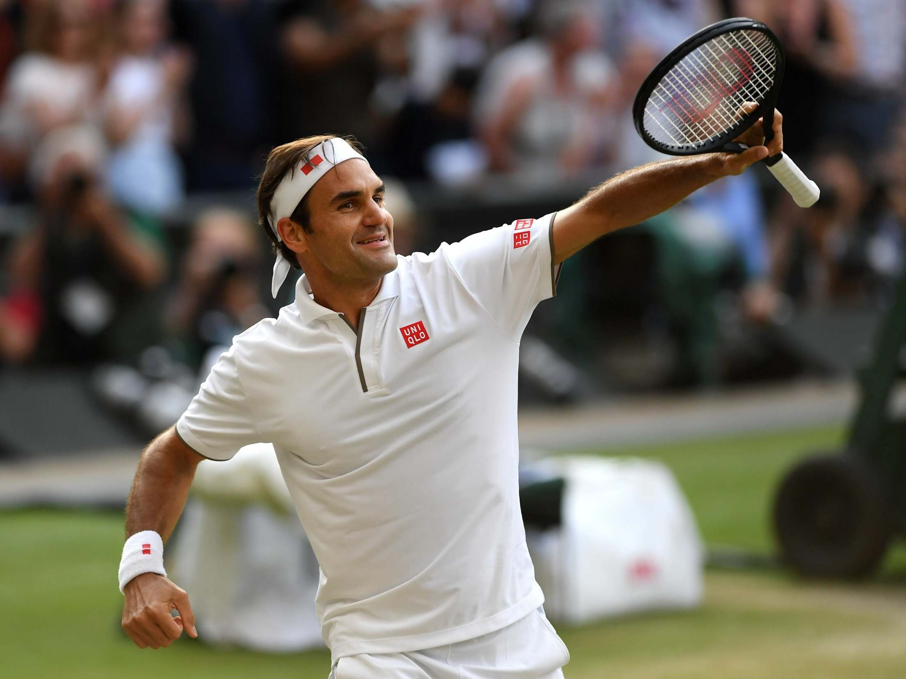
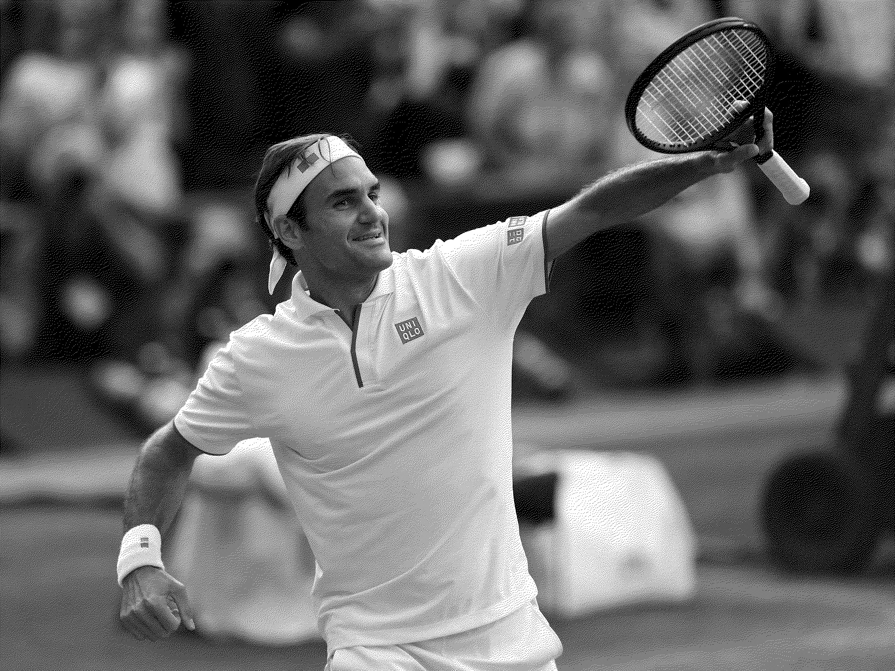

# Image Processing
## Project for the Object-Oriented Programming course at FMI

The main task is to create console application to implement of 11 (or 13 :D) algorithms from this article : https://tannerhelland.com/2012/12/28/dithering-eleven-algorithms-source-code.html , to crop and to resize images

The program can read image from a file with one of the extensions: .ppm, .pgm, .pbm (only ASCII formats supported, Binary ones to be implemented at a later stage). User can choose one of thirteen dithering algorithms, crop or resize and choose file format for the resulting version of the image.

# Exemple:
We have this image in ppm format:

And after Floyd-Steinberg algorithm we have this:

*the images are jpg because ppm is not supported but this is the idea*

TODO:
- add Binary formats implementation
- divide the program into even smaller classes
- look for optimization